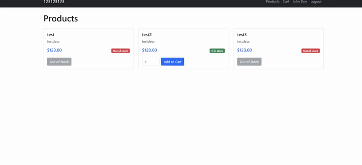

# Cart+Checkout Demo Setup Instructions

Working demo for Cart & Checkout, **IGNORE login and products page**.



## Features

### Main Features
- **Cart Management**: Add/remove products, update quantities, view cart contents
- **Checkout Process**: Complete order processing with stock updates

### Supporting Features
- **Products**: View products with name, description, price, and stock
- **Authentication**: Simple login system for demo users

## Setup Instructions

1. **Install Dependencies** (if not already done):
   ```bash
   composer install
   npm install
   ```

2. **Environment Setup**:
   - Copy `.env.example` to `.env`
   - Configure your database settings in `.env`
   - Generate application key: `php artisan key:generate`

3. **Database Setup**:
   ```bash
   php artisan migrate
   php artisan db:seed
   ```

4. **Start the Application**:
   ```bash
   php artisan serve
   ```

5. **Access the Demo**:
   - Goto: http://localhost:8000
   - Grab any user:
     - john@example.com : password123
     - jane@example.com : password123
     - bob@example.com : password123

## DB Schema

- **users**: id, name, email, password, timestamps
- **products**: id, name, description, price, stock, timestamps
- **carts**: id, user_id, product_id, quantity, timestamps