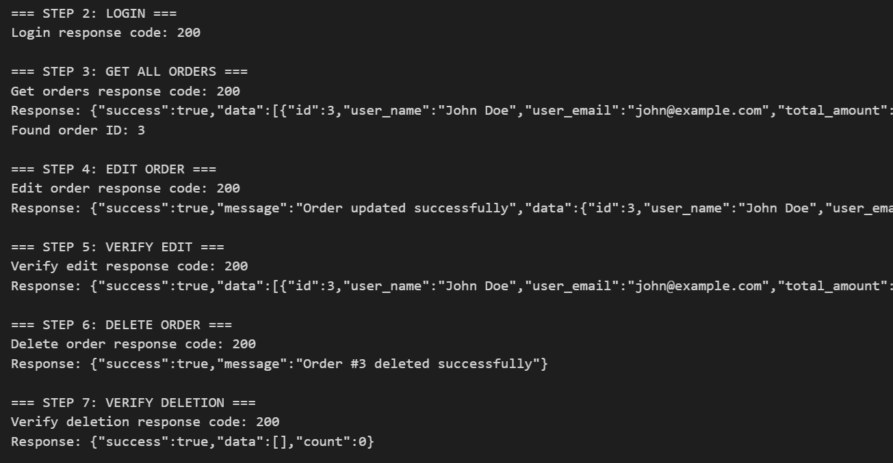
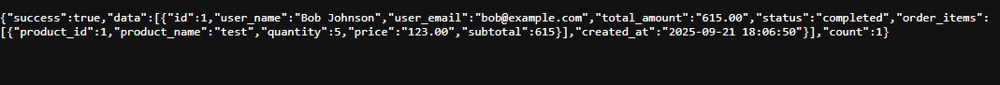

**Visit: http://localhost:8000/admin/orders** (Login as john@example.com first)

**Visit: http://localhost:8000/**

## Features

### Main Features
- **Cart Management**: Add/remove products, update quantities, view cart contents
- **Checkout Process**: Complete order processing with stock updates
- **Admin**: View/Alter/Delete orders

### Supporting Features
- **Products**: View products with name, description, price, and stock
- **Authentication**: Simple login system for demo users
- **Order Management**: Track completed orders with detailed information

## Setup Instructions

1. **Install Dependencies** (if not already done):
   ```bash
   composer install
   npm install
   ```

2. **Environment Setup**:
   - Copy `.env.example` to `.env`
   - Configure your database settings in `.env`
   - Generate application key: `php artisan key:generate`

3. **Database Setup**:
   ```bash
   php artisan migrate
   php artisan db:seed
   ```

4. **Start the Application**:
   ```bash
   php artisan serve
   ```

5. **Access the Demo**:
   - Goto: http://localhost:8000
   - Grab any user:
     - john@example.com : password123 (Admin user)
     - jane@example.com : password123
     - bob@example.com : password123

## Admin Panel

### Admin Access
- **Admin User**: john@example.com (password: password123)
- **Admin Endpoints**: 
  - `GET /admin/orders` - View all orders
  - `PUT /admin/orders/{id}` - Edit order
  - `DELETE /admin/orders/{id}` - Delete order
- **Response Format**: JSON

### Admin Features
- **View Orders**: View all orders with customer details
- **Edit Orders**: Update order status, total amount, and order items
- **Delete Orders**: Remove orders from the system
- Track order items, quantities, and totals
- Monitor order status and timestamps
- Secure access with admin middleware

### API Usage Examples

#### View All Orders
```bash
curl -X GET "http://localhost:8000/admin/orders" \
  -H "Cookie: laravel_session=YOUR_SESSION_COOKIE" \
  -H "Content-Type: application/json"
```

#### Edit Order
```bash
curl -X PUT "http://localhost:8000/admin/orders/1" \
  -H "Cookie: laravel_session=YOUR_SESSION_COOKIE" \
  -H "Content-Type: application/json" \
  -d '{
    "status": "processing",
    "total_amount": 99.99,
    "order_items": [
      {
        "product_id": 1,
        "product_name": "Test Product",
        "quantity": 2,
        "price": 49.99
      }
    ]
  }'
```

#### Delete Order
```bash
curl -X DELETE "http://localhost:8000/admin/orders/1" \
  -H "Cookie: laravel_session=YOUR_SESSION_COOKIE" \
  -H "Content-Type: application/json"
```

### Testing
- **Test Script**: Run `php test_orders.php` to test all order management functionality
- **Test Results**: Check `test_result.txt` for detailed test output and results
- **Validation**: All endpoints include proper validation and error handling

### Order Validation Rules

#### Edit Order Validation
- `status`: Required, must be one of: `pending`, `processing`, `shipped`, `delivered`, `cancelled`
- `total_amount`: Required, must be a positive number
- `order_items`: Required, must be an array
- Each order item must include:
  - `product_id`: Required, must exist in products table
  - `product_name`: Required, string
  - `quantity`: Required, integer, minimum 1
  - `price`: Required, positive number

#### Response Formats

**Success Response (Edit Order):**
```json
{
  "success": true,
  "message": "Order updated successfully",
  "data": {
    "id": 1,
    "user_name": "John Doe",
    "user_email": "john@example.com",
    "total_amount": "99.99",
    "status": "processing",
    "order_items": [...],
    "created_at": "2025-01-20 10:30:00",
    "updated_at": "2025-01-20 11:45:00"
  }
}
```

**Success Response (Delete Order):**
```json
{
  "success": true,
  "message": "Order #1 deleted successfully"
}
```

**Error Response:**
```json
{
  "success": false,
  "message": "Validation failed",
  "errors": {
    "status": ["The status field is required."],
    "total_amount": ["The total amount must be a positive number."]
  }
}
```

## DB Schema

- **users**: id, name, email, password, is_admin, timestamps
- **products**: id, name, description, price, stock, timestamps
- **carts**: id, user_id, product_id, quantity, timestamps
- **orders**: id, user_id, order_items (JSON), total_amount, status, timestamps
